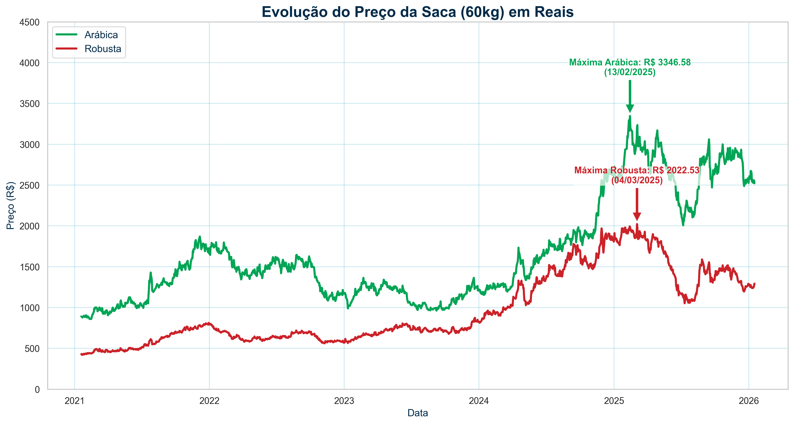
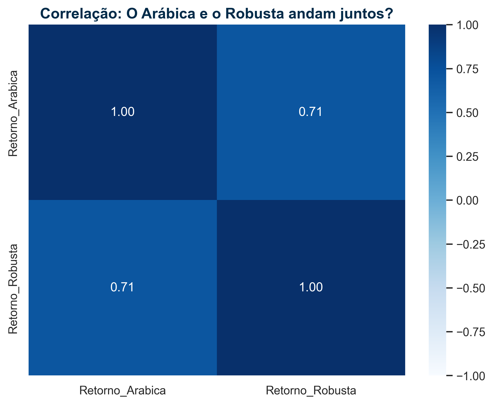
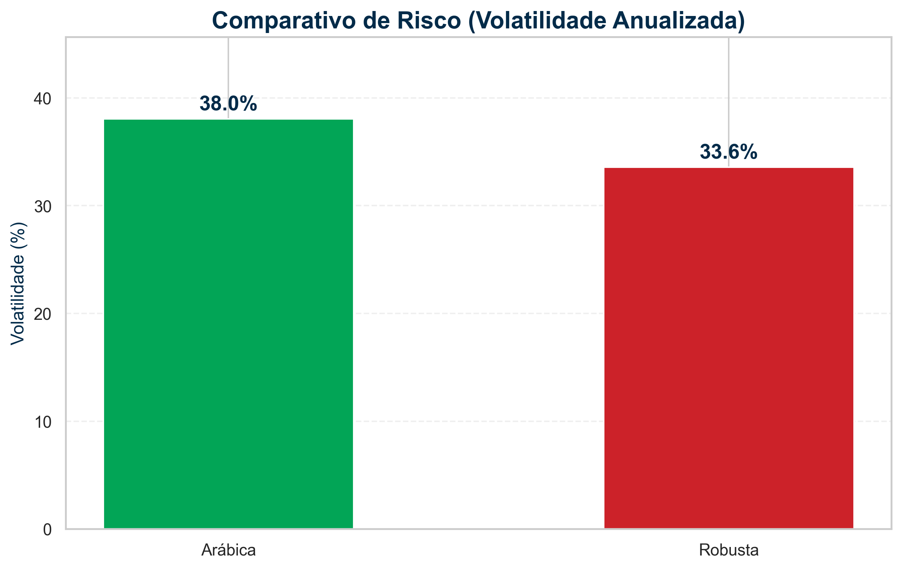
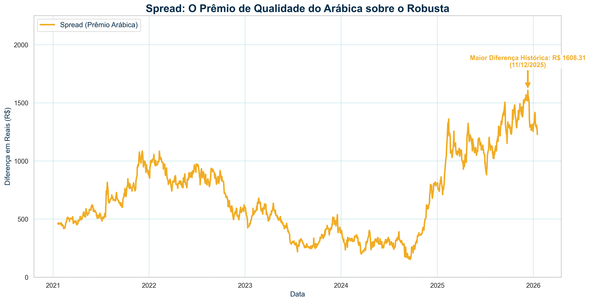
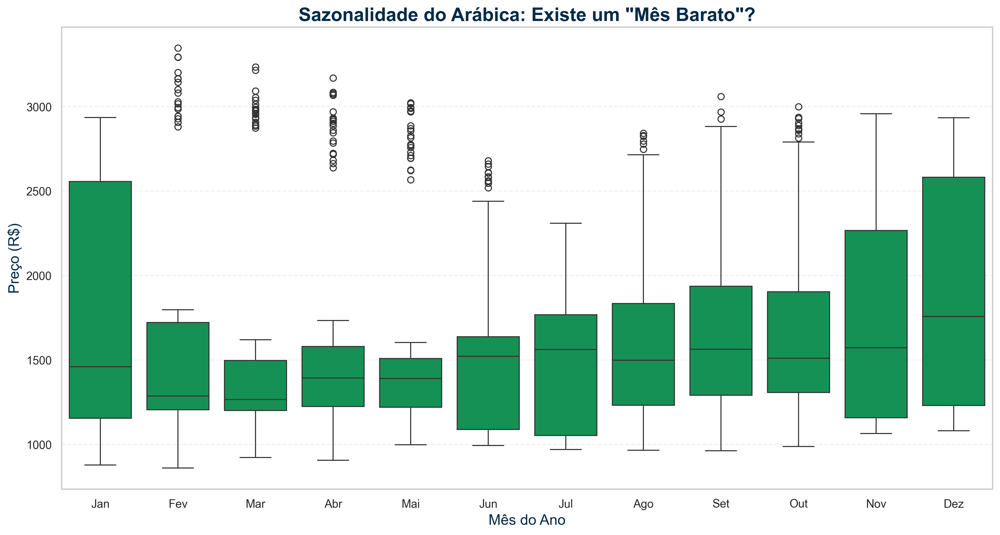
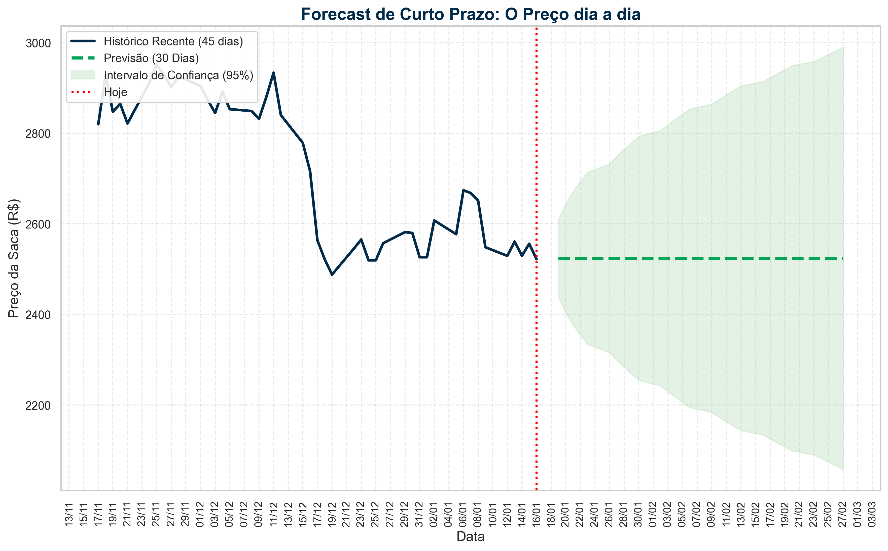
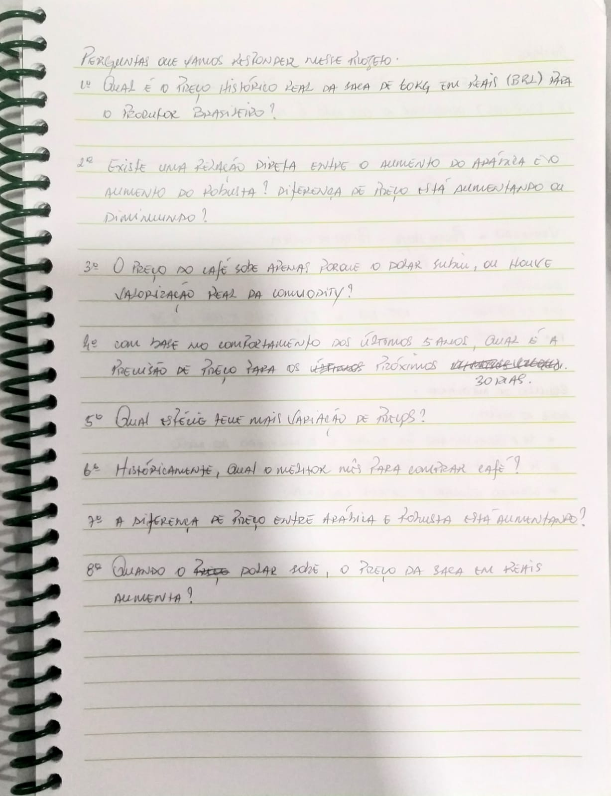

# ☕ Strategic Coffee Forecast: Inteligência de Dados para Commodities


---

## 💼 O Cenário de Negócio (The Business Case)

> *"No mercado de commodities, o lucro não está apenas na venda, mas na eficiência da compra."*

Grandes compradores de café (indústrias, redes de franquias e exportadores) enfrentam um dilema financeiro constante: **A Volatilidade**.
Uma decisão de compra tomada no momento errado, influenciada por falsas percepções cambiais (Dólar) ou desconhecimento dos ciclos de safra, pode resultar em prejuízos milionários em estoque.

### 🎯 O Objetivo
Este projeto foi desenvolvido para responder a uma pergunta de 1 milhão de reais:
**"Como usar dados históricos para prever a melhor janela de compra e mitigar riscos de mercado?"**

Minha missão foi transformar 5 anos de dados brutos da bolsa (B3/Nyse) em uma **estratégia de aquisição** baseada em 3 pilares:
1.  📉 **Redução de Custo:** Identificar a sazonalidade exata (o mês mais barato e seguro).
2.  💵 **Inteligência Macro:** Separar o que é inflação do Dólar vs. escassez real do grão.
3.  🔮 **Previsibilidade:** Projetar o preço futuro (Forecast) para apoio à decisão de curto prazo.

---

## 🗺️ O Mapa da Investigação (Business Questions)

Para garantir que a análise gerasse valor real, o projeto foi guiado por **8 Perguntas Estratégicas** divididas em 3 pilares de decisão:

### 📊 Pilar 1: Comportamento & Risco (Entendendo o Mercado)
* **P1.** Qual o preço histórico real da saca em Reais (BRL) para o produtor?
* **P2.** Existe correlação direta entre o aumento do Arábica e do Robusta?
* **P3.** Qual espécie é mais volátil (arriscada) para se investir?
* **P4.** O "Spread" (diferença de preço) entre as espécies está aumentando?

### 🗓️ Pilar 2: Estratégia Sazonal (O Timing da Compra)
* **P5.** Historicamente, qual é o melhor mês para comprar (Janela de Ouro)?

### 💵 Pilar 3: Macroeconomia & Futuro (Cenários)
* **P6.** O preço sobe por escassez real ou apenas por variação do Dólar?
* **P7.** Quando o Dólar sobe, o preço da saca obrigatoriamente aumenta?
* **P8.** Qual é a previsão de preço para os próximos 30 dias (Forecast)?

---

### 📉 Insights do Pilar 1: Comportamento & Risco

**1. O Patamar Histórico de Preços (Resposta à P1)**
A análise da evolução diária (em BRL) revelou que não estamos em um crescimento linear, mas em um "Rally" de preços sem precedentes recentes.
* **O Fato:** O Café Arábica atingiu o pico de **R$ 3.346,58** (Fev/2025), enquanto o Robusta rompeu pela primeira vez a barreira dos **R$ 2.022,53** (Mar/2025).
* **A Conclusão:** O preço para o produtor efetivamente **dobrou** em comparação à média de 2021-2023, exigindo uma rekalibragem imediata do orçamento de compras da indústria.



**2. A Dinâmica de Correlação (Resposta à P2)**
Muitos gestores tentam fazer *hedge* (proteção) operando as duas pontas, mas a Matriz de Correlação de Pearson revelou um coeficiente de **0.71**.
* **O Insight:** Existe uma **Forte Correlação Positiva**. Os preços de Arábica e Robusta caminham juntos na maior parte do tempo. Isso significa que não é possível diversificar o risco apenas comprando a outra espécie; se o mercado sobe, ele sobe em bloco.



**3. Quem é o Vilão do Risco? (Resposta à P3)**
Ao calcularmos a *Volatilidade Anualizada* dos ativos, quantificamos o risco de exposição de cada espécie.
* **O Resultado:** O **Arábica (38.0%)** provou ser um ativo consideravelmente mais volátil que o **Robusta (33.6%)**.
* **Impacto no Negócio:** Contratos baseados puramente em Arábica exigem uma margem de segurança financeira maior devido à oscilação agressiva de preços.



**4. O Spread e o Custo de Oportunidade (Resposta à P4)**
O gráfico de "Spread" monitora a diferença de preço entre a saca de Arábica e a de Robusta.
* **O Alerta Crítico:** Em Dezembro/2025, o spread atingiu sua máxima histórica de **R$ 1.608,31**.
* **A Consequência:** Com o prêmio de qualidade do Arábica tão alto, a indústria é forçada a alterar o *blend*, consumindo mais Robusta para manter a margem. Esse movimento de substituição explica a pressão de compra recente sobre o Robusta.



---

### 🗓️ Insights do Pilar 2: Estratégia Sazonal

**5. A Janela de Ouro de Compra (Resposta à P5)**
A análise de sazonalidade (Boxplot Mensal) quebrou o paradigma de que "comprar na safra (Julho) é sempre melhor".
* **O Risco da Safra:** Julho apresenta médias baixas, mas alta amplitude de variação (risco de geadas e quebra de safra), o que torna o planejamento financeiro incerto.
* **A Descoberta:** Identificamos **Março** como o mês estratégico. Ele combina preços competitivos com a **menor dispersão do ano** (caixa compacta).
* **Decisão:** Comprar em Março garante previsibilidade orçamentária, evitando a exposição à volatilidade do segundo semestre.



---

### 💵 Insights do Pilar 3: Macroeconomia & Futuro

**6. O Mito do Dólar (Resposta às P6 e P7)**
Uma hipótese comum era de que a alta do café seria puramente cambial. Para testar isso, normalizamos os preços em "Base 100" (jan/2021 = 100) para comparar a valorização relativa.
* **O Veredito:** O gráfico mostra um descolamento agressivo. Enquanto o Dólar (Linha Azul Tracejada) permaneceu estável, o preço do Robusta (Linha Vermelha) valorizou mais de **350%** e o Arábica **300%**.
* **Conclusão:** O aumento de preço é **Real (Estrutural)**, causado por escassez de oferta global, e não por desvalorização da moeda brasileira.


**7. O Futuro: Forecast de 30 Dias (Resposta à P8)**
Utilizando o modelo estatístico **Holt-Winters (Suavização Exponencial)**, projetamos o cenário para o próximo mês para apoiar a decisão de curto prazo.
* **Tendência:** O modelo aponta para uma **Estabilidade Lateral**. O "pico" de alta perdeu força, mas não há sinal de queda brusca.
* **O Preço Alvo:** A previsão central gira em torno de **R$ 2.524,00**.
* **Gestão de Risco:** Calculamos um intervalo de confiança (95%) onde o preço pode flutuar entre **R$ 2.057 (Piso)** e **R$ 2.990 (Teto)**.



---

## 🛠️ Stack Tecnológico
* **Linguagem:** Python 3.10
* **Análise & Manipulação:** Pandas, NumPy
* **Visualização:** Seaborn, Matplotlib
* **Estatística & ML:** Statsmodels (Holt-Winters), Scipy
* **Fonte de Dados:** Yahoo Finance (Agregador)
   * *Arábica:* ICE Futures U.S. (Nova York)
   * *Robusta:* ICE Futures Europe (Londres)
* **Armazenamento:** Arquivos CSV (Processados na pasta `data/`)

## 🚀 Como Executar o Projeto
```bash
# 1. Clone o repositório
git clone [https://github.com/ArymanReis/strategic-coffee-forecast.git](https://github.com/ArymanReis/strategic-coffee-forecast.git)

# 2. Instale as dependências
pip install -r requirements.txt

# 3. Execute os notebooks na ordem numérica
jupyter notebook

## 🧠 Bastidores: Onde Tudo Começou
Antes de escrever a primeira linha de código, o projeto foi desenhado no papel.
Acreditamos que a tecnologia é apenas o meio para resolver problemas de negócio bem definidos. A imagem abaixo registra o planejamento inicial das perguntas estratégicas:

<div align="center">
  
  <p><em>"Do Rascunho ao Deploy: O roteiro de perguntas que guiou a análise."</em></p>
</div>

