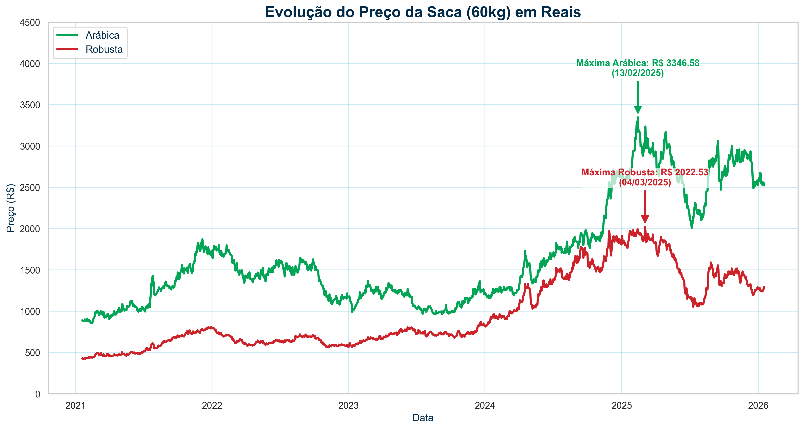
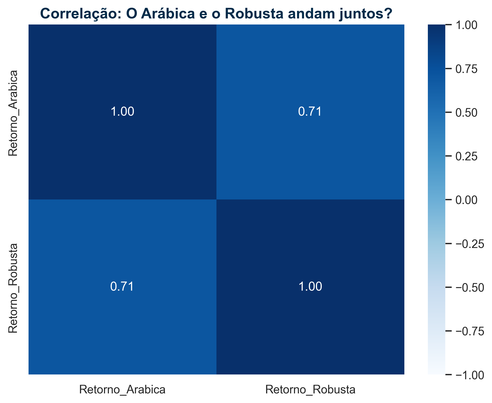
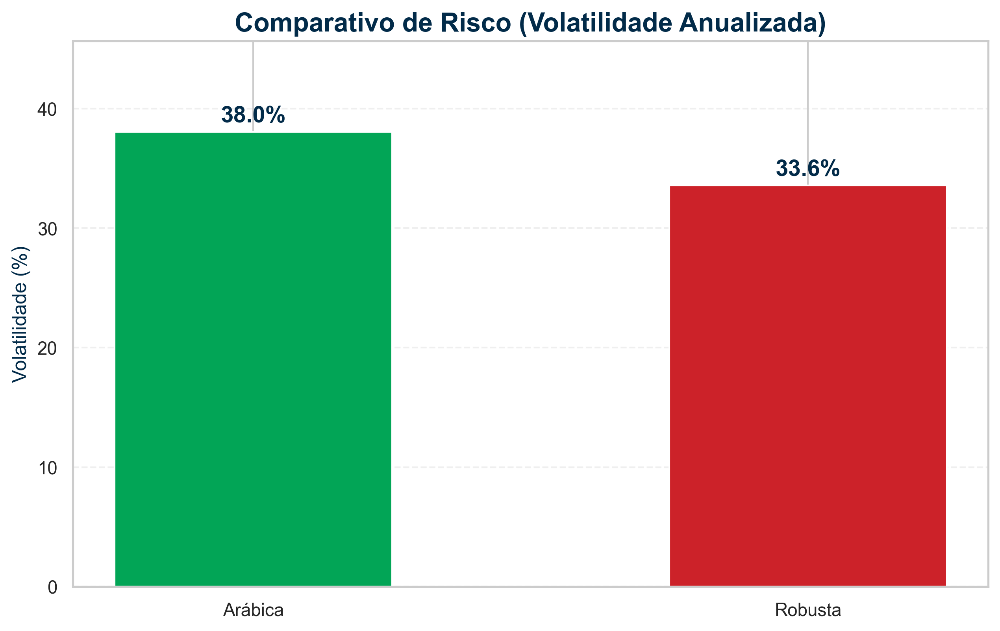
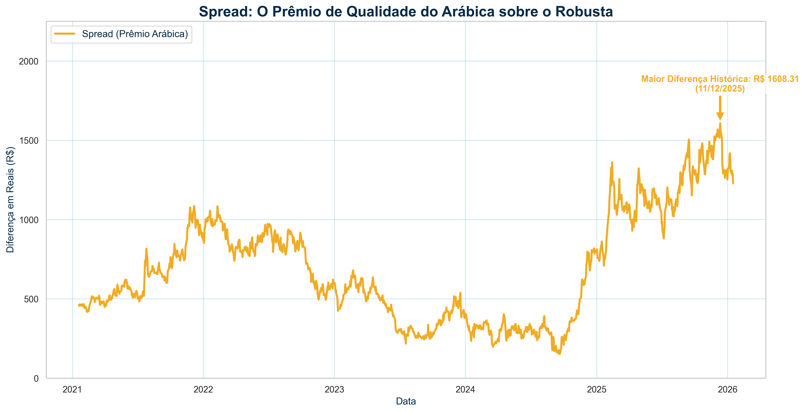
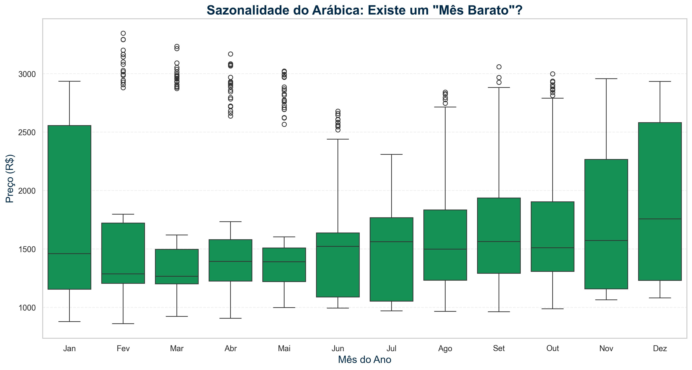
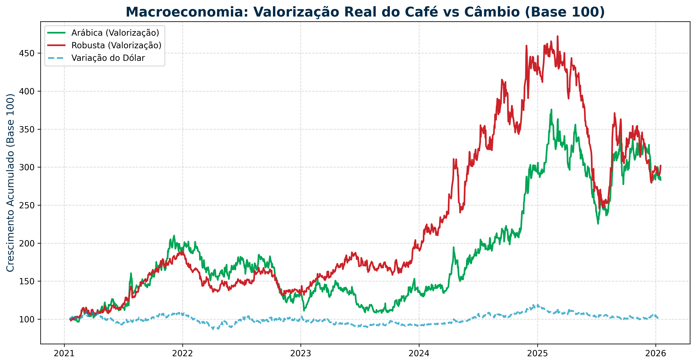
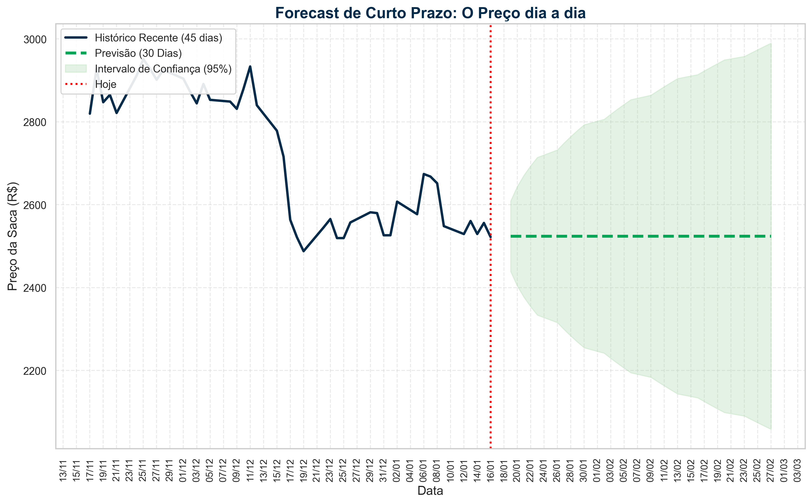
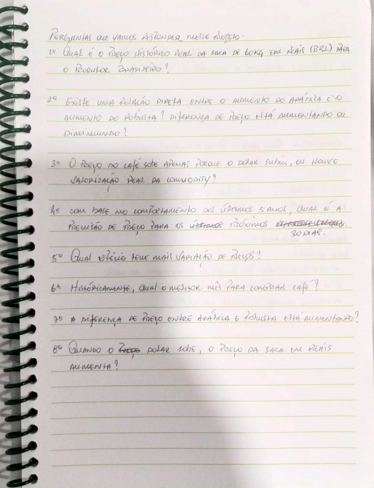

# ☕ Strategic Coffee Forecast  
### Inteligência de Dados aplicada à tomada de decisão em Commodities


---

## 💼 Contexto de Negócio

> *No mercado de commodities, o resultado financeiro não depende apenas da venda, mas principalmente do **timing da compra***.

Empresas que dependem da aquisição de café (indústrias, exportadores e grandes redes) enfrentam um desafio recorrente: **alta volatilidade de preços**.  
Decisões de compra baseadas apenas em percepção de mercado ou variação cambial podem gerar **impactos financeiros significativos no estoque**.

Este projeto utiliza **dados históricos de mercado** para transformar incerteza em **apoio analítico à decisão**.

---

## 🎯 Objetivo do Projeto

Responder de forma orientada a dados à seguinte pergunta de negócio:

> **“Como utilizar dados históricos para identificar a melhor janela de compra e reduzir riscos financeiros?”**

Para isso, o projeto se apoia em três pilares analíticos:

1. 📉 **Redução de custos:** identificação de padrões sazonais de preço  
2. 💵 **Análise macroeconômica:** separação entre efeito cambial e escassez real  
3. 🔮 **Previsibilidade:** projeção de curto prazo para apoio tático à decisão  

---

## 🗺️ Perguntas de Negócio Investigadas

A análise foi guiada por **8 perguntas estratégicas**, organizadas em três eixos:

### 📊 Pilar 1 — Comportamento & Risco
- **P1.** Qual o preço histórico real da saca em BRL?
- **P2.** Existe correlação entre Arábica e Robusta?
- **P3.** Qual espécie apresenta maior volatilidade?
- **P4.** O spread entre as espécies está se ampliando?

### 🗓️ Pilar 2 — Estratégia Sazonal
- **P5.** Qual o melhor mês histórico para compra?

### 💵 Pilar 3 — Macroeconomia & Previsão
- **P6.** A alta de preços é cambial ou estrutural?
- **P7.** O dólar influencia diretamente o preço da saca?
- **P8.** Qual a projeção de preço para os próximos 30 dias?

---

## 📉 Insights — Pilar 1: Comportamento & Risco

### 1️⃣ Evolução Histórica de Preços (P1)

📌 **Pergunta:** O preço do café segue uma tendência linear ou estrutural?  
💡 **Insight:** O mercado entrou em um **rally histórico**, rompendo patamares inéditos.

- Arábica: **R$ 3.346,58 (Fev/2025)**
- Robusta: **R$ 2.022,53 (Mar/2025)**

➡️ **Impacto prático:** O custo médio da matéria-prima praticamente dobrou em relação a 2021–2023, exigindo revisão orçamentária.



---

### 2️⃣ Correlação entre Espécies (P2)

📌 **Pergunta:** É possível reduzir risco alternando entre Arábica e Robusta?  
💡 **Insight:** Correlação positiva forte (**0,71**).

➡️ **Impacto prático:** Comprar a outra espécie **não elimina risco**, pois os preços se movem juntos.



---

### 3️⃣ Volatilidade Comparada (P3)

📌 **Pergunta:** Qual espécie apresenta maior risco financeiro?  
💡 **Insight:**  
- Arábica: **38,0%**
- Robusta: **33,6%**

➡️ **Impacto prático:** Contratos baseados em Arábica exigem maior margem de segurança.



---

### 4️⃣ Análise de Spread (P4)

📌 **Pergunta:** O diferencial de preço entre espécies está se ampliando?  
💡 **Insight:** Spread recorde de **R$ 1.608,31 (Dez/2025)**.

➡️ **Impacto prático:** Pressão para substituição parcial por Robusta, afetando demanda e preços.



---

## 🗓️ Insights — Pilar 2: Estratégia Sazonal

### 5️⃣ Janela Ótima de Compra (P5)

📌 **Pergunta:** Comprar na safra é sempre a melhor opção?  
💡 **Insight:** Março apresenta **menor dispersão de preços**, mesmo sem ser mês de safra.

➡️ **Decisão:** Março oferece maior previsibilidade orçamentária.



---

## 💵 Insights — Pilar 3: Macroeconomia & Previsão

### 6️⃣ Efeito Cambial vs Escassez Real (P6 & P7)

📌 **Pergunta:** A alta é causada pelo dólar?  
💡 **Insight:** Não. O preço do café cresce muito acima da variação cambial.

➡️ **Impacto prático:** A valorização é **estrutural**, ligada à oferta global.



---

### 7️⃣ Forecast de Curto Prazo (P8)

📌 **Pergunta:** O que esperar no próximo mês?  
💡 **Insight:** Estabilidade lateral.

- Preço estimado: **R$ 2.524**
- Intervalo (95%): **R$ 2.057 – R$ 2.990**

➡️ **Uso prático:** Apoio tático à decisão de compra.



---

## 🛠️ Stack Tecnológico
- **Python 3.10**
- Pandas, NumPy
- Seaborn, Matplotlib
- Statsmodels (Holt-Winters), Scipy
- Fonte: Yahoo Finance (ICE NY / ICE Europe)

---

## 🧠 Planejamento Analítico

O projeto foi estruturado **antes do código**, com definição clara das perguntas de negócio.

<div align="center">
  
  <p><em>Do problema de negócio à modelagem analítica.</em></p>
</div>

---

## 🚀 Execução

```bash
git clone https://github.com/ArymanReis/strategic-coffee-forecast.git
pip install -r requirements.txt
jupyter notebook
